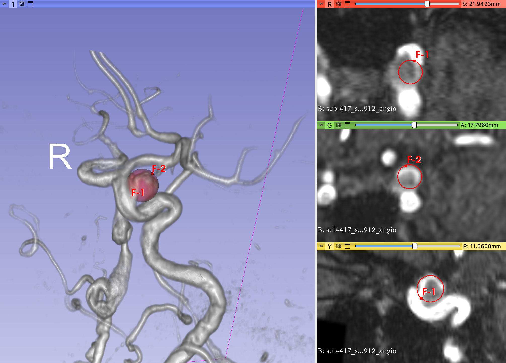

# Intracranial Aneurysm Detection: An object detection perspective
This repository contains the official software code and annotations related to the paper ["Intracranial Aneurysm Detection: An object detection perspective"](https://link.to.paper/).

# Abstract
Intracranial aneurysm detection from 3D Time-Of-Flight Magnetic Resonance Angiography images is a problem of increasing clinical importance. Recently, a streak of methods have shown promising performance by using segmentation neural networks. However, these methods may be less relevant in a clinical settings where diagnostic decisions rely on detecting objects rather than their segmentation. We introduce a 3D single-stage object detection method tailored for small object detection such as aneurysms. Our anchor-free method incorporates fast data annotation, adapted data sampling and generation to address class imbalance problem, and spherical representations for improved object detection. A comprehensive evaluation was conducted, comparing our method with the state-of-the-art SCPM-Net[1], nnDetection[2] and nnUNet[3] baselines, using two datasets comprising 402 subjects, including one public dataset [4]. The evaluation used adapted object detection metrics. Our method exhibited comparable or superior performance, with an average precision of 78.96%, sensitivity of 86.78%, and 0.53 false positives per case. Our method significantly reduces the detection complexity compared to existing methods, and highlights the advantages of object detection over segmentation-based approaches for aneurysm detection. It also holds potential for application to other small object detection problems.

# Description
The project is organized into two main directories: "Data_dir" and "Work_dir". The "Data_dir" contains data related to patients (P0001, P0002, etc.) and a working directory called "Work_dir" that stores training samples (Train001, Train002, etc.) for custom training.

1. Within each patient's folder in "Data_dir", there are several files such as "volume.nii.gz", which contains the 3D MRA image, "noskull.nii.gz", which contains the brain (without skull) volume, "aneurysm.csv", which lists the coordinates of points defining each aneurysm, and "points.csv", which lists the coordinates of candidate negative patches used for training. All of these files are grouped together under a "config.json" file. See an example in reproductibity/Data/P0001.

2. In the "Work_dir", there is a directory called "Train001" that contains the configuration of a customized training (called "ndl_config.json") and stores the checkpoint model called "last_checkpoint.pytorch". see an example in reproductibity/Work_dir/Train001.

# Usage
To use our code, follow the following steps:
## Preparation
1. Clone the repository by running the following commands:
    ```
    git clone https://gitlab.inria.fr/yassis/DeepAneDet.git
    cd DeepAneDet
    ```
2. Edit the "Docker" file by specifying the user_name, group_name, PYTHONPATH, and the configuration of Jupyterlab.
3. Create the Docker container by running the following commands:
    ```
    chmod +x buildDocker.sh
    ./buildDocker
    ```
4. Run the Docker container by running the following two commands:
    ```
    chmod +x runDocker.sh
    ./runDocker
    ```
5. Access to the Jupyterlab from your browser.
6. Prepare the data by generating the "noskull.nii.gz" and "points.csv" files for each patient in the dataset:
    ```
    python resources/scripts/removeSkull.py
    python resources/scripts/extractPoints.py
    ```

## Traning
1. Generate a customized training sample  (e.g. Train001 directory)  using the command:
    ```
    python prepare.py
    ```

2. Based on the generated configuration file in "Train001/ndl_config.json", start the training and validation phase by running the following two commands:
    ```
    chmd +x resources/scripts/train.py 
    ./resources/scripts/train.py path/to/Train001
    ```

## Inference
* Use the script "predict.py" to perform inference by running:
    ```
    chmd +x resources/scripts/predict.py
    ./resources/scripts/predict.py path/to/Train001
    ```
* The predictions are generated in "path/to/Train001/Predictions". For each patient, the predictions are saved in a separate JSON file. Each prediction includes the center coordinates (x, y, z) in mm, the radius in mm, and a confidence score as a percentage.


## Evaluation
- Evaluate the model using the script "evaluate.py" by running:
    ```
    chmd +x resources/scripts/evaluate.py
    ./resources/scripts/evaluate.py path/to/Train001
    ```
- After running the evaluation script, the results are generated as a PNG figure that summarizes the performance of the model on the test images. This figure can be found in the "path/to/Train001/Predictions" directory. 

# Annotations and Reproductibity
In order to overcome the limitations of voxel-wise annotation, weak annotation is used to annotate aneurysms. This involves approximating the shape of aneurysms using spheres. 

As illustrated in the figure below, to create these spheres, two points are used as reference: the center of the neck of the aneurysm (F1) and the dome of the aneurysm (F2). The sphere is then created to enclose the aneurysm using these two points as a guide.



To support the reproducibility of our paper, we provide access to the annotations used in the public dataset [4] at "Reproductibity/Annotations". Each subject file contains the ground truth annotation of aneurysms as two points with 3D coordinates. Moreover, to replicate the 5-fold cross-validation approach employed in our paper, the subjects used in each fold can be found at "Reproductibity/Fold?".

# References
[1] Xiangde et al., SCPM-Net: An anchor-free 3D lung nodule detection network using sphere representation and center points matching. Medical image analysis, 75 pp. 102287. Elsevier (2022)

[2] Baumgartner et al., nndetection: A self-configuring method for medical object detection. In: International Conference on Medical Image Computing and Computer-Assisted Intervention. pp. 530–539. Springer (2021).

[3] Isensee et al., nnU-Net: a self-configuring method for deep learning-based biomedical image segmentation, Nature methods 18(2), pp. 203–211 (2021).

[4] Di Noto et al., Towards automated brain aneurysm detection in TOF-MRA: open data, weak labels, and anatomical knowledge. Neuroinformatics, pp. 1-14 (2022).


# Acknowledgements
This work was funded by Region Grand-Est, CHRU University hospital of Nancy in France.
